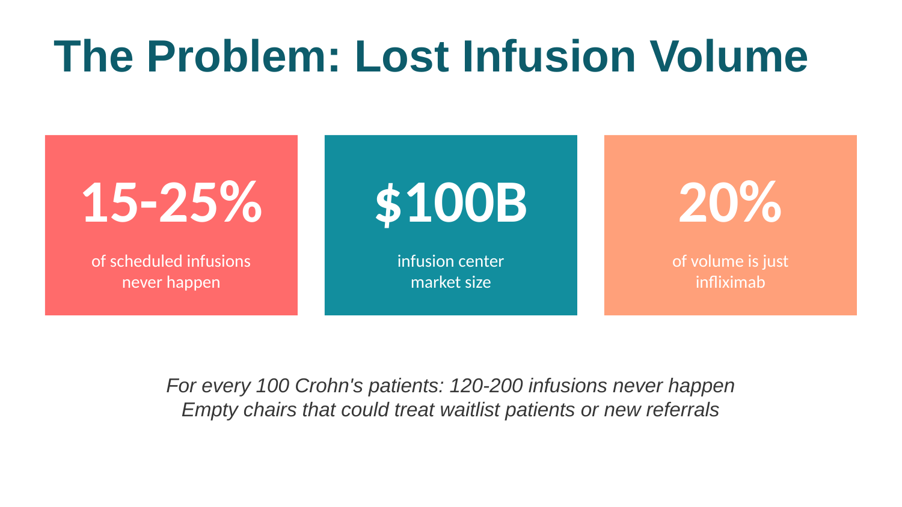
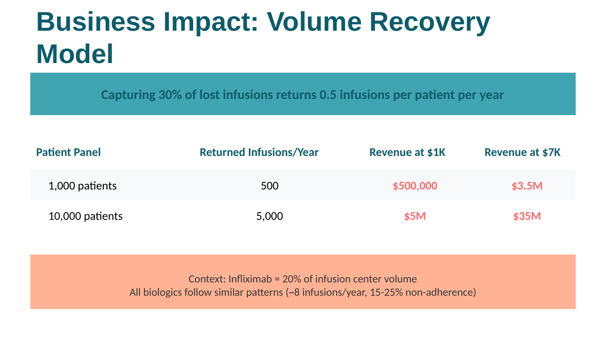
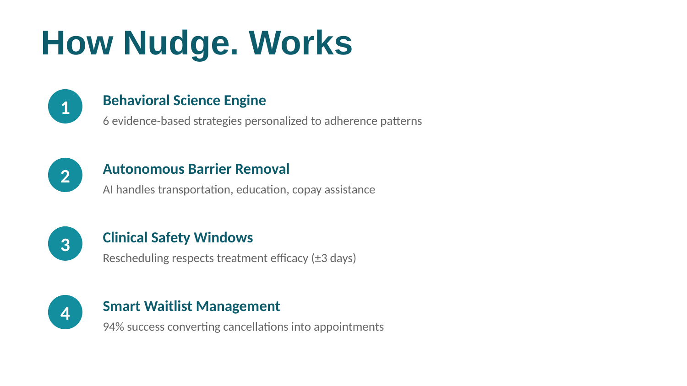

# Nudge.
**Portfolio AI adherence platform that demonstrates how to return lost infusions back to the healthcare system**

Non-adherence costs infusion centers 15-25% of scheduled volume. Nudge. demonstrates how capturing 30% of those losses could return 0.5 infusions per patient per year—representing significant value at scale.

**Built with:** React 19 · TypeScript · Google Gemini AI · Google Cloud Run

[**Try Live Demo →**](https://nudge-922488968064.us-west1.run.app/)

---

## The Problem

Infusion centers lose 15-25% of scheduled volume to non-adherence. For every 100 Crohn's patients on infliximab receiving 8 infusions/year, 120-200 infusions never happen—empty chairs that could treat waitlist patients or accommodate new referrals.

Nudge. demonstrates how to return these lost infusions to the system through AI-powered behavioral nudges, autonomous barrier removal, and smart waitlist matching.

---

## Business Impact

**The Model:** Capturing 30% of lost infusions could return 0.5 infusions per patient per year

| Patient Panel | Returned Infusions/Year | Value at $1K/infusion | Value at $7K/infusion |
|---------------|-------------------------|----------------------|----------------------|
| 1,000 patients | 500 | $500,000 | $3.5M |
| 10,000 patients | 5,000 | $5M | $35M |

**Context:**
- Non-adherence rate: 15-25% (industry standard for infliximab)
- Infliximab patients represent 20% of all infusion center volume
- All biologics require ~8 infusions/year with similar adherence patterns
- Total addressable market: $100B infusion center industry

📊 [**Full Business Case & ROI Analysis**](docs/BUSINESS_CASE.md)

📑 [**Executive Summary (PDF)**](docs/Patient_Adherence_Platform_Presentation.pdf) - 8-slide pitch deck

---

## How It Works

### 1. Behavioral Science Engine
Evidence-based nudge strategies personalized to adherence patterns, i.e.:
- **Positive Reinforcement** (98% adherence) → Celebrates 12-visit streaks
- **Loss Aversion** (65% adherence) → Emphasizes 8-week treatment windows
- **Social Proof** (42% adherence) → Shows waitlist impact

### 2. Autonomous Barrier Removal
AI agent with tool-calling capabilities:
- ✅ Verifies patient addresses
- ✅ Schedules clinic shuttles / rideshare vouchers
- ✅ Provides copay assistance information
- ✅ Offers educational resources on-demand

### 3. Clinical Safety Windows
Rescheduling respects treatment efficacy (±3 days for infliximab)

### 4. Smart Waitlist Management
AI matching engine scans cancellations → reaches out to aligned waitlist patients

**Result:** Improved patient adherence; Lost slots converted into appointments

---

## Key Features

- ✅ **Modular Architecture** – Features toggle on/off based on clinic capabilities
- ✅ **Provider Control Panel** – Clinical registry tracks strategies, adherence rates, confirmation status
- ✅ **FHIR-Compatible** – Structured patient data models designed for EHR integration
- ✅ **Multi-Stakeholder Views** – Separate patient and clinic/operations interfaces
- ✅ **Evidence-Based** – Built on behavioral economics research in healthcare
- ✅ **Safety-first** – State-of-the-Art Security and Safety Safeguards

---

## Security and Safety Safeguards

Nudge leverages a multi-layered governance framework designed to bridge the gap between flexible AI interaction and the rigid safety requirements of clinical environments. By implementing a strictly deterministic execution engine combined with modular administrative controls, the system mitigates the risks of stochastic AI behavior and "hallucinations." Every patient interaction is grounded in a specific clinical persona and bounded by hard-coded safety logic, ensuring that while the platform is empathetic, it remains medically sound and operationally compliant.

### Core Safety Features:

**🔒 Deterministic Execution Engine**  
Employs a zero-temperature configuration and fixed random seed to eliminate stochastic variance, ensuring that the AI provides reproducible, reliable, and predictable responses for identical clinical scenarios.

**⚕️ Clinical Safety Guardrails**  
Visual and logic-based "Safety Windows" (±3 days) are enforced during all scheduling workflows to maintain treatment efficacy and prevent the system from proposing medically non-compliant appointment shifts.

**👥 Human-in-the-Loop (HITL) Escalation**  
A native `escalate_to_human` tool is integrated into the model's toolset, allowing the AI to automatically identify and handover complex clinical concerns or sensitive patient issues to qualified medical coordinators.

**⚙️ Modular Feature Governance**  
A centralized "Operations Lab" allows administrators to toggle high-touch features (e.g., transportation coordination, copay assistance) in real-time, providing an "air-gap" between AI capabilities and actual clinic resources.

**🎯 Contextual Grounding & Logic Constraints**  
Strict system instructions prevent the model from hallucinating dates or medical protocols. The AI is restricted to using only provided clinical data (e.g., adherence rates, assigned nurse) to drive its behavioral nudge logic.

**📊 Engagement Analytics & Auditability**  
Real-time tracking of digital engagement (e.g., resource click counts) and treatment adherence creates a transparent audit trail, allowing clinicians to verify the impact of AI-driven outreach on real-world health outcomes.

**🔐 Secure Credential Management**  
Sensitive API interfaces are managed exclusively via server-side environment variables, ensuring that clinical data access remains protected and credentials are never exposed in the client-side source code.

## Technical Stack

**Frontend:** React 19, TypeScript, Vite, Tailwind CSS  
**AI:** Google Gemini API with function calling & autonomous tool use  
**Deployment:** Google Cloud Run (containerized, auto-scaling)  
**Data Models:** FHIR-compatible patient state, clinical notes, appointments

### Core Architecture:
- `geminiService.ts` – LLM integration with behavioral strategy injection
- `sandboxService.ts` – Mock EHR data source (designed for FHIR API swap)
- `types.ts` – Comprehensive TypeScript clinical data models
- Reusable UI components: `AppointmentCard`, `VisualCalendar`, `HealthLibrary`

---

## Use Cases

### Specialty Clinics
- Infusion centers (IBD, rheumatology, oncology)
- Chronic disease management programs
- Preventive care adherence

### Healthcare Systems
- Population health management
- Value-based care initiatives
- Care coordination platforms

### Health Tech Companies
- Patient relationship management tools
- Digital health engagement platforms
- Clinical workflow optimization

---

## What Makes This Different

Most patient reminder systems send generic texts. Nudge. demonstrates a different approach:

- **Behavioral science** – Different patients need different nudges (Behavioral evidence-based strategies)
- **Autonomous agents** – AI removes barriers (transportation, cost, knowledge) without human escalation
- **Clinical integration** – Respects treatment windows (±3 days), not just calendar availability
- **Health economics focus** – Built around value modeling, not just engagement metrics

---

## Roadmap

### Phase 1: Integration (Current)
- FHIR API integration for live EHR data
- SMS/WhatsApp deployment via Twilio
- Analytics dashboard for adherence metrics

### Phase 2: Scale
- Multi-language support
- A/B testing framework for nudge strategies
- Predictive no-show risk scoring

### Phase 3: Enterprise
- HIPAA-compliant production deployment
- Epic/Cerner integration modules
- Multi-facility management console

---

## Clinical Validation

Designed following best practices in:
- Behavioral economics in healthcare (Thaler, Kahneman)
- Clinical decision support systems (HL7 FHIR)
- Health literacy and patient education (AHRQ guidelines)
- Regulatory compliance (FDA Software as Medical Device, HIPAA)

---

## 📫 Contact

**Anna Kuperberg, MD**  
Digital Health Product Leader

[LinkedIn](https://linkedin.com/in/anna_kuperberg_md) | kuperberg.anna@gmail.com

Physician turning clinical insights into AI products that scale. Built patient adherence platforms, led enterprise healthcare AI implementations, navigated FDA/CE regulatory processes.

**Looking for:** Product leadership roles in healthcare AI—especially opportunities to combine clinical expertise with technical execution at scale.

---

## License

MIT License – See LICENSE for details

---

## 🏷️ GitHub Topics

When uploading to GitHub, add these topics to increase discoverability:

`react` `typescript` `healthcare` `digital-health` `patient-engagement` `generative-ai` `google-gemini` `ai-agents` `behavioral-science` `chronic-disease` `healthcare-ai` `conversational-ai` `google-cloud` `patient-adherence` `autonomous-agents`

---

## Note

This is a **portfolio demonstration system** showcasing AI product development capabilities, health economics modeling, and full-stack technical implementation. The platform demonstrates how behavioral science and autonomous AI agents could address patient adherence challenges in infusion centers. Clinical deployment would require validation studies, regulatory review, and integration with certified EHR systems.

**Market context:** Infliximab represents ~20% of infusion center volume. All biologics (TNF inhibitors, IL inhibitors, etc.) follow similar adherence patterns (~8 infusions/year, 15-25% non-adherence). The total infusion center market is a $100B industry.

**Financial modeling:** Infusion center marginal revenue ranges from $1,000-$7,000+ per infusion depending on facility type (hospital outpatient vs. ambulatory), payer mix, and drug-specific reimbursement. Business case uses conservative estimates at the lower bound.

Built with insights from frontline clinical teams managing chronic disease programs.
